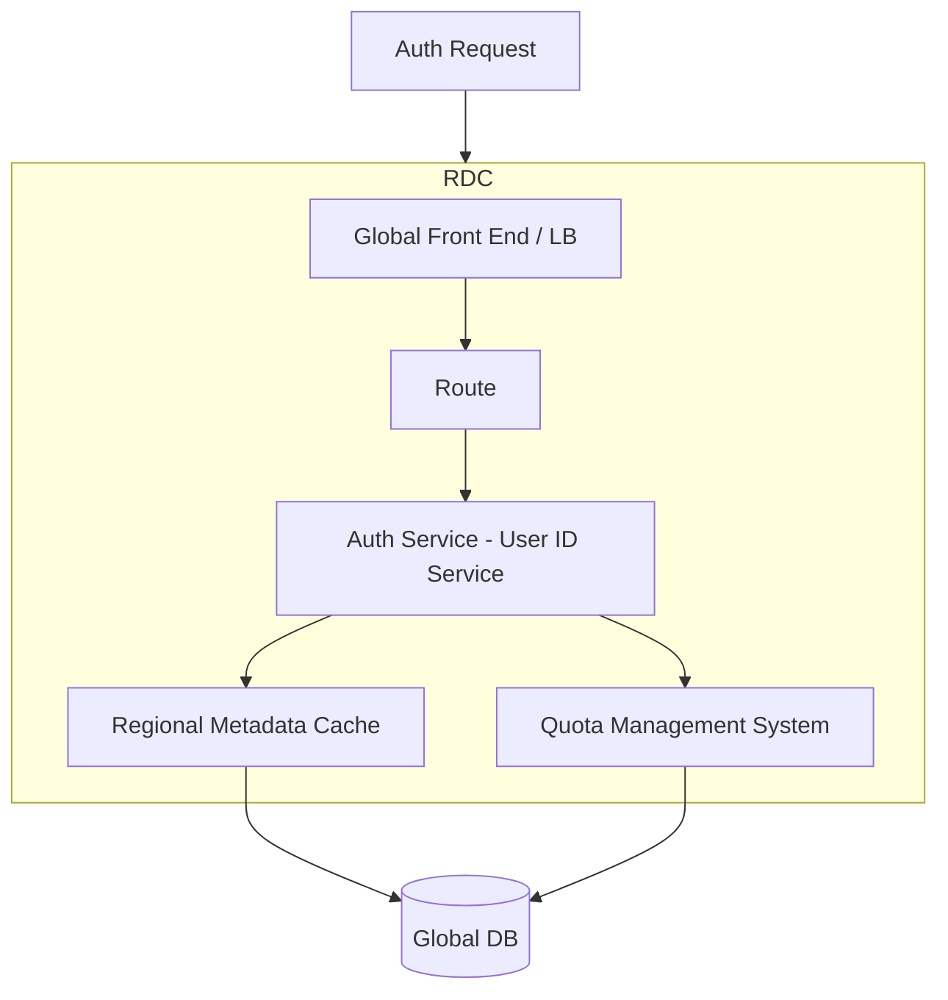

This post is a test for Mermaid diagram rendering.

```mermaid
graph TD;
    AuthReq[Auth Request] --> RDC[Regional Data Center - Shared];
    subgraph RDC
        LB[Global Front End / LB] --> Route[Route];
        Route --> AuthS[Auth Service - User ID Service];
        AuthS --> Cache[Regional Metadata Cache];
        AuthS --> Quota[Quota Management System];
    end
    Cache --> DB[(Global DB)];
    Quota --> DB;
```

If the diagram renders correctly, you should see a flowchart above.
